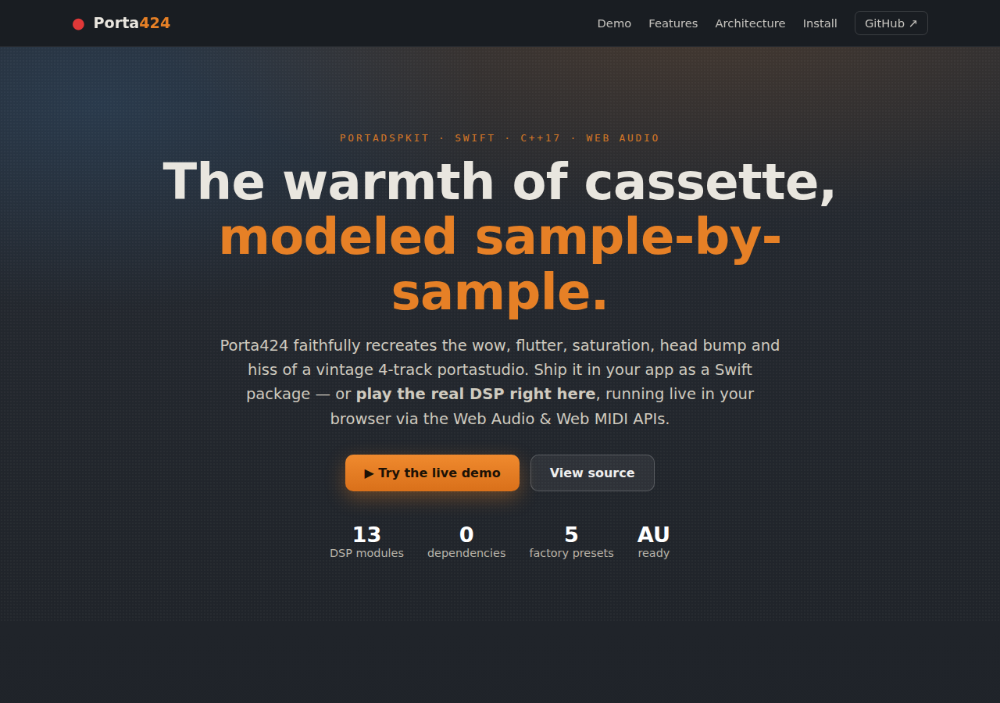
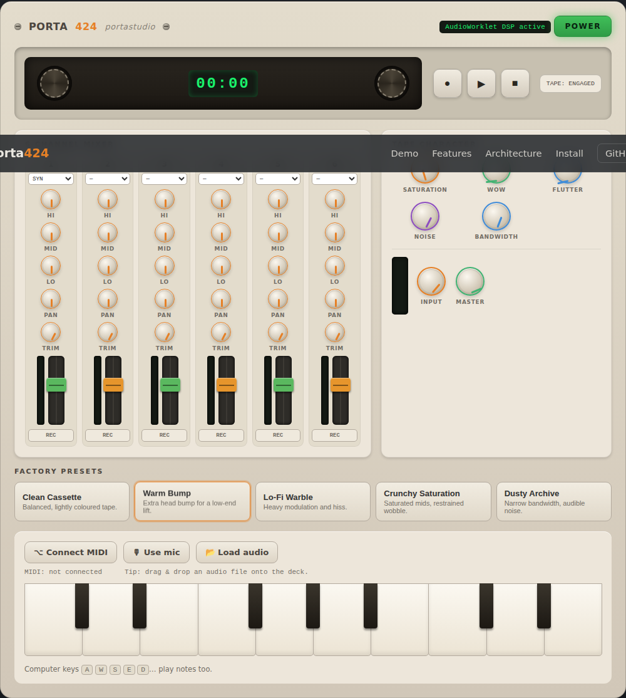

# Porta424 — Marketing site & live demo

A single-page marketing site for **PortaDSPKit / Porta424** with an interactive,
in-browser recreation of the 4-track cassette portastudio. The tape-character DSP
runs live via the **Web Audio API** (an `AudioWorklet`), and the synth + tape
knobs are playable over the **Web MIDI API**.

Zero dependencies, no build step — plain HTML/CSS/ES modules, matching the
product's "zero dependencies" ethos.




## Run locally

Because ES modules and `AudioWorklet` require `http(s)://` (not `file://`), serve
the folder with any static server:

```bash
cd web
python3 -m http.server 8000   # then open http://localhost:8000
# or:  npx serve .
```

Click **POWER** first — browsers require a user gesture before audio can start.

## What the demo does

| Area | Implementation |
| --- | --- |
| Tape character | `js/tape-worklet.js` — an `AudioWorkletProcessor` porting the C++ `wow_flutter`, `saturation`, `hiss` and `dropouts` modules (modulated fractional delay line, `tanh` soft clip, additive colored noise, smoothed random dropouts). |
| Head bump / bandwidth | Native `BiquadFilterNode`s (peaking ~80 Hz Q 1.4, lowpass 1–20 kHz). |
| 6-channel mixer | Per channel: trim, 3-band EQ, pan, fader, record-arm, source select — each its own Web Audio node chain into a shared mix bus. |
| Sources | Built-in subtractive **synth** (Web MIDI + on-screen/computer keyboard), **microphone** (`getUserMedia`), and **audio file** upload (drag-and-drop or picker). |
| Presets | `js/presets.js` mirrors the 5 factory presets from `PortaDSPFactoryPresets.swift`; values are converted back to UI/audio params with the same math as `DSPState.swift`. |
| Metering / transport | `AnalyserNode` RMS VU meters, animated reels, LED tape counter. |

### Graceful degradation

- No `AudioWorklet` → falls back to a `WaveShaper` (tanh) + noise buffer for hiss
  (wow/flutter/dropouts disabled); the on-screen badge reports this.
- No Web MIDI → the on-screen and computer keyboards still play the synth.
- Honors `prefers-reduced-motion`.

## File layout

```
web/
├── index.html            # all marketing sections + demo shell
├── css/styles.css        # retro design system (palette from RetroTheme.swift)
├── js/
│   ├── main.js           # boots engine, builds deck, wires controls
│   ├── audio-engine.js   # Web Audio graph (channels, tape chain, master, meters)
│   ├── tape-worklet.js   # AudioWorkletProcessor (tape DSP)
│   ├── synth.js          # polyphonic subtractive synth
│   ├── midi.js           # Web MIDI access, notes + CC mapping
│   ├── ui-controls.js    # accessible Knob & Fader components
│   └── presets.js        # factory presets + DSPState mapping
└── assets/               # favicon + screenshots
```

## Deployment

`.github/workflows/pages.yml` publishes `web/` to GitHub Pages on every push to
`main`. Enable it under **Settings → Pages → Source: GitHub Actions**.
